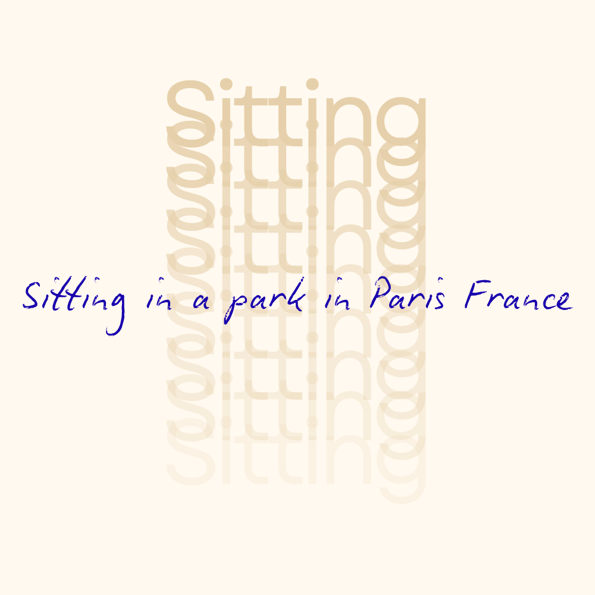
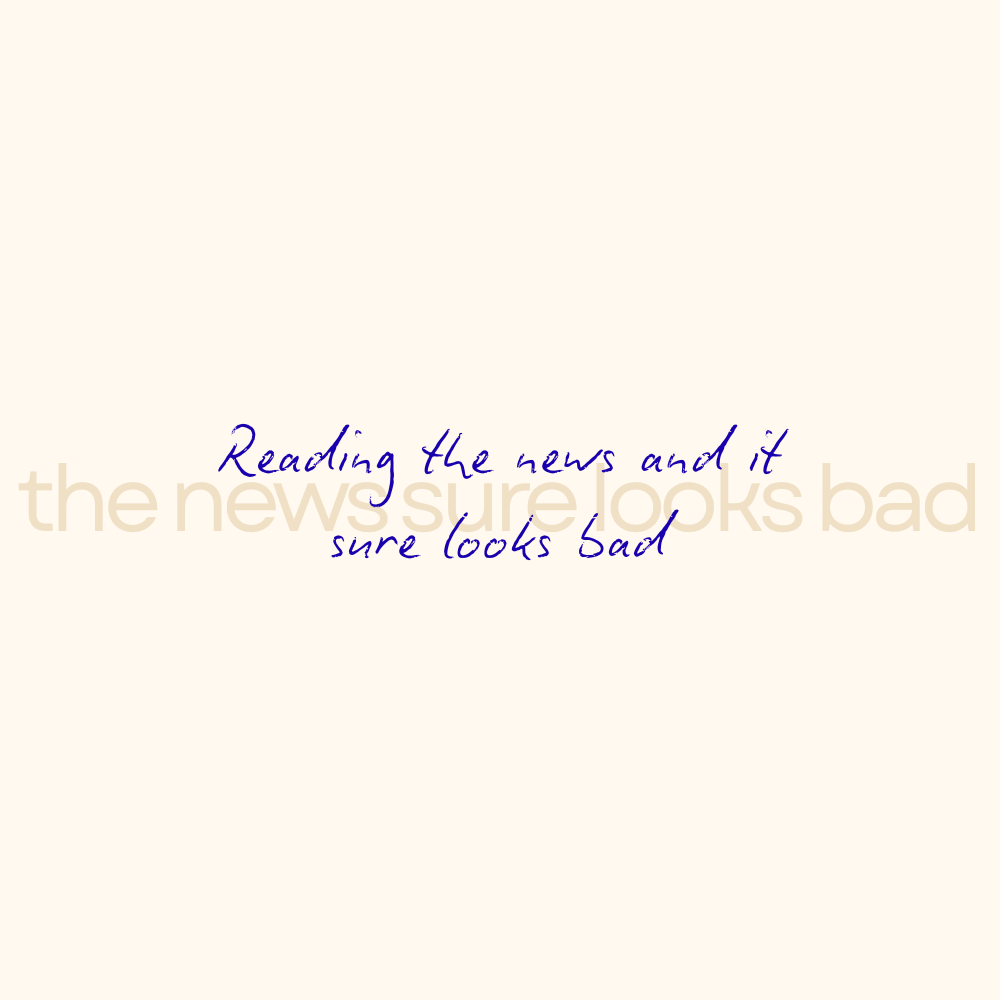
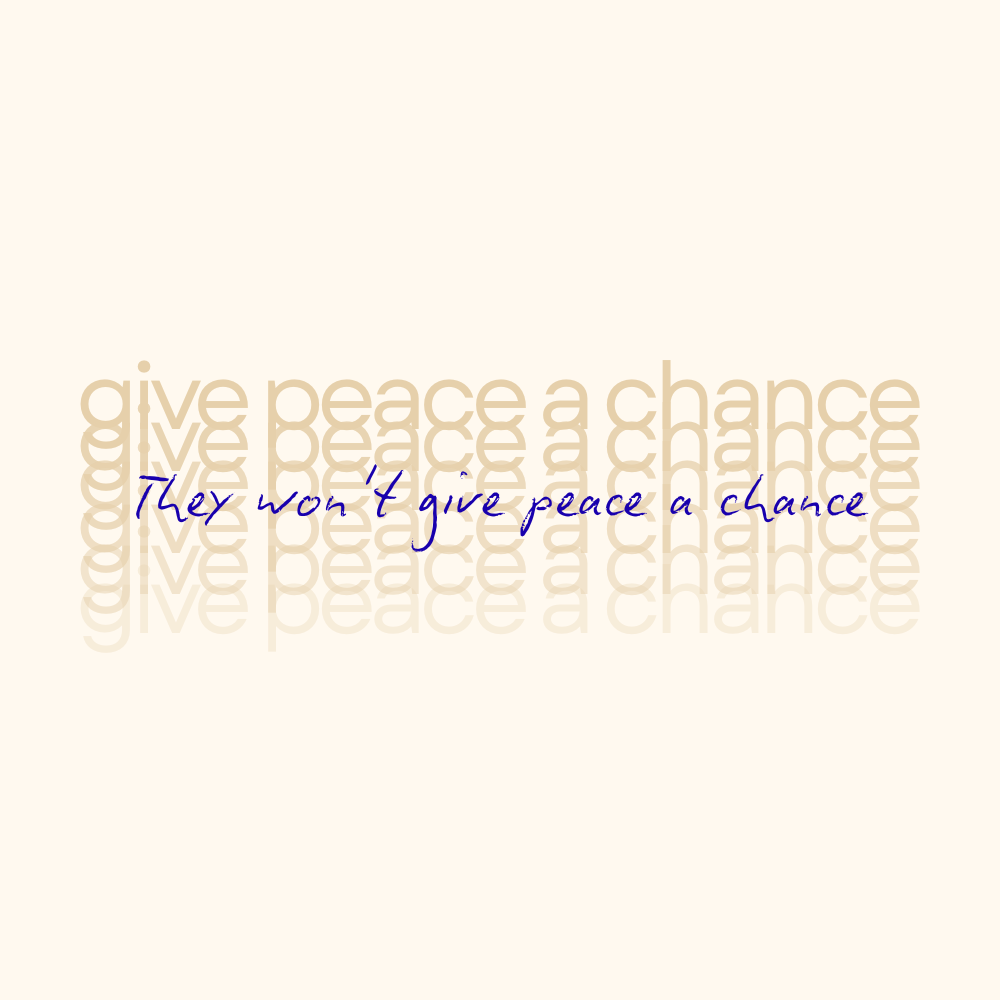
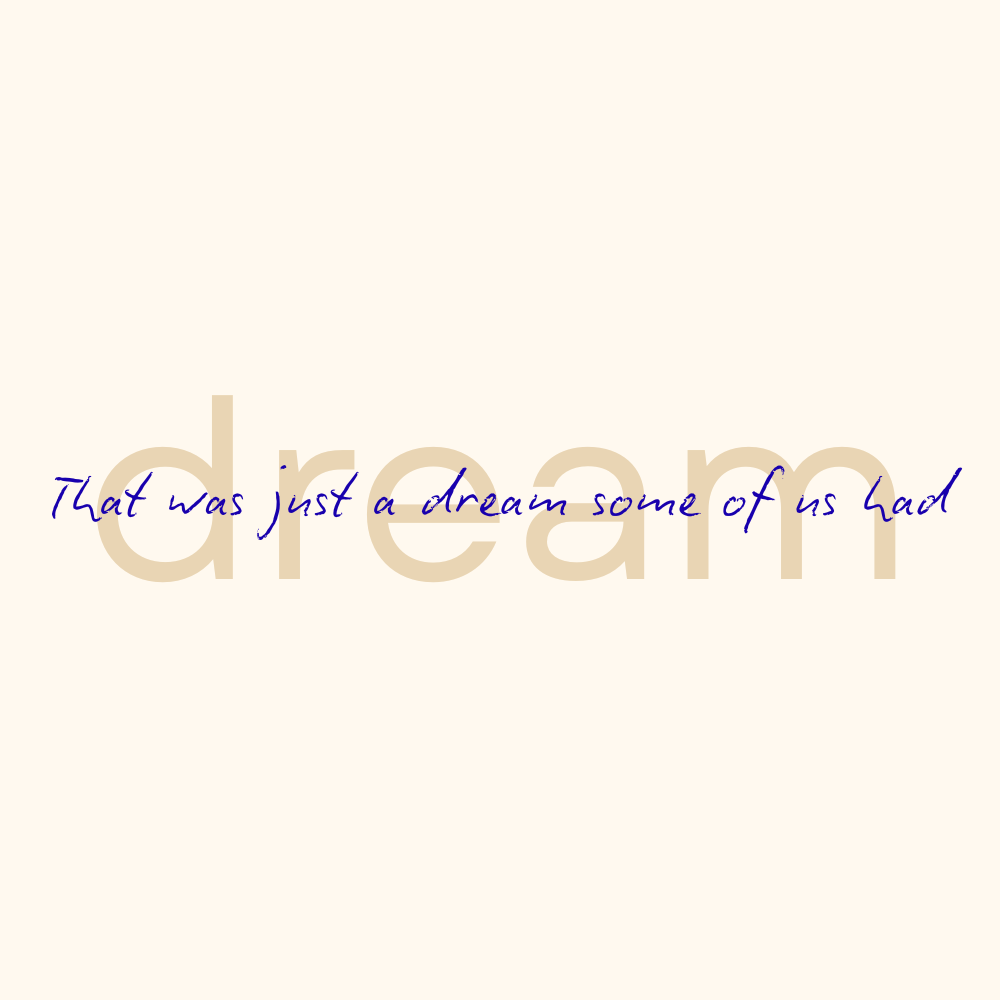

# title
California

# project overview
This project is intended to show what community means to me. I think community means support and feeling like you belong, and how without it you can feel homesick, but you know it is always there. This project is intentionally supposed to be personal and like a love letter to my community. 

# technical overview

**Page 1 — "sitting"**

**Page 2 — "the news looks bad"**

**Page 3 — "give peace a chance"**

**Page 4 — "dream"**

# acknowledgment
The song "California" was written and composed by Joni Mitchell in 1971

The JavaScript cascade animation was adapted from a CodePen by Miguel Vera.
Source: https://codepen.io/mikeeveraa/pen/dyEzrLq

AI assistance provided by Claude (claude.ai) for help modifying, debugging, and explaining code throughout this project.

